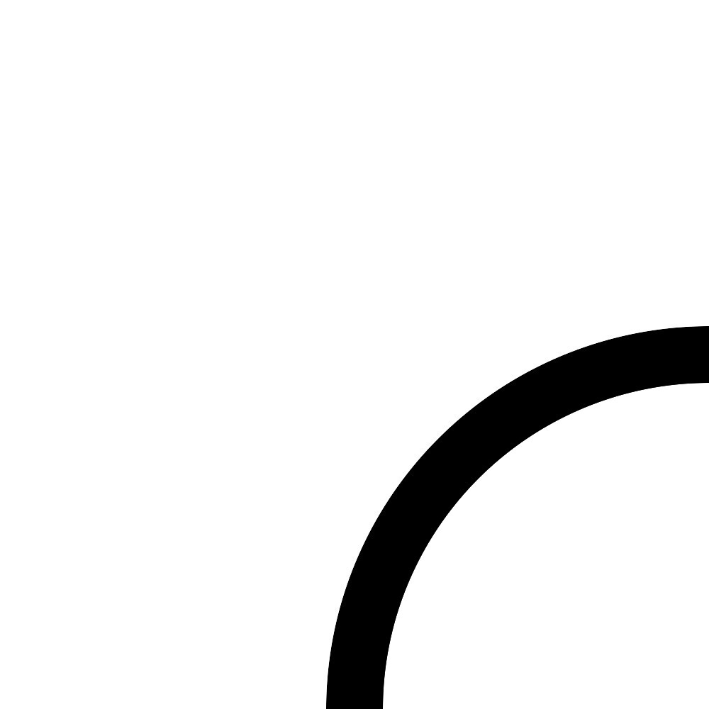

[English](README.en.md) | [日本語](README.md)

# raspimouse_sim

ROS 2 package suite for Raspberry Pi Mouse Simulator runs on Gazebo


## ROS 2 Package Status

| main develop<br>(ros2)|Humble + Ubuntu Jammy<br>(humble-devel)|
|:---:|:---:|
|[](https://github.com/rt-net/raspimouse_sim/actions?query=branch%3Aros2+workflow%3Aindustrial_ci)|[](https://github.com/rt-net/raspimouse_sim/actions?query=branch%3Ahumble-devel+workflow%3Aindustrial_ci)|

## Requirements

requires the following to run:

* Ubuntu
  * Ubuntu Jammy Jellyfish 22.04.*
* ROS 2
  * ROS Humble Hawksbill
* Gazebo
  * Ignition Gazebo 6.x
* ROS 2 Package
  * ros-humble-desktop-full

## Installation

Download this ROS 2 package.

```sh
cd ~/ros2_ws/src
git clone -b ros2 https://github.com/rt-net/raspimouse_sim.git
```

Download the dependent ROS 2 packages.

```sh
cd ~/ros2_ws/src
git clone https://github.com/rt-net/raspimouse_ros2_examples.git
git clone -b ros2 https://github.com/rt-net/raspimouse_description.git
rosdep install -r -y -i --from-paths raspimouse*
```

Build this package using `colcon`.

```sh
cd ~/ros2_ws
colcon build --symlink-install
source ~/ros2_ws/install/setup.bash
```

## QuickStart

After building this package, run the following commands.

```sh
ros2 launch raspimouse_gazebo raspimouse_with_emptyworld.launch.py
```

## Examples

### Joystick Controll

Terminal 1:

```sh
ros2 launch raspimouse_gazebo raspimouse_with_emptyworld.launch.py
```

Terminal 2:

```sh
ros2 launch raspimouse_ros2_examples teleop_joy.launch.py joydev:="/dev/input/js0" joyconfig:=f710 mouse:=false
```


### Object Tracking

Terminal 1:

```sh
ros2 launch raspimouse_gazebo raspimouse_with_color_objects.launch.py use_rgb_camera:=true
```

Terminal 2:

```sh
ros2 launch raspimouse_ros2_examples object_tracking.launch.py mouse:=false use_camera_node:=false
```


### camera_line_follower 

Terminal 1:

```sh
ros2 launch raspimouse_gazebo raspimouse_with_line_follower_field.launch.py use_rgb_camera:=true camera_downward:=true
```

Terminal 2:

```sh
ros2 launch raspimouse_ros2_examples camera_line_follower.launch.py mouse:=false use_camera_node:=false
```

Terminal 3: Start

```sh
ros2 topic pub --once /switches raspimouse_msgs/msg/Switches "{switch0: false, switch1: false, switch2: true}"
```

Terminal 3: Stop
```sh
ros2 topic pub --once /switches raspimouse_msgs/msg/Switches "{switch0: true, switch1: false, switch2: false}"
```

For information on parameters in camera line follower, click [here](https://github.com/rt-net/raspimouse_ros2_examples/blob/master/README.en.md#parameters).


### SLAM & Navigation

#### SLAM

Terminal 1:
```sh
ros2 launch raspimouse_gazebo raspimouse_with_lakehouse.launch.py lidar:=urg
```
The lidar option supports `urg`, `lds`, and `rplidar`.

Terminal 2:
```sh
ros2 launch raspimouse_ros2_examples teleop_joy.launch.py joydev:="/dev/input/js0" joyconfig:=f710 mouse:=false
```

Terminal 3:
```sh
ros2 launch raspimouse_slam pc_slam.launch.py
```


Terminal 4:
```sh
ros2 run nav2_map_server map_saver_cli -f ~/MAP_NAME
```


#### Navigation

Terminal 1:
```sh
ros2 launch raspimouse_gazebo raspimouse_with_lakehouse.launch.py lidar:=urg
```
The lidar option supports `urg`, `lds`, and `rplidar`.

Terminal 2:
```sh
ros2 launch raspimouse_navigation pc_navigation.launch.py map:=$HOME/MAP_NAME.yaml
```


## Model data list

### course_curve_50x50cm
Curve course panel for line following.
Panel size is 50 cm x 50 cm and line width is 4 cm.



### course_straight_50x50cm
Straight course panel for line following.
Panel size is 50 cm x 50 cm and line width is 4 cm.


### cube_*cm_color-name
Each cube is 5 cm, 7.5 cm, 10 cm, and 15 cm, 30 cm on a side.
The cube colors are red, yellow, blue, green and black.


### about dae files
The dae file is edited in Blender 4.0.

## License

This repository is licensed under the MIT license, see [LICENSE]( ./LICENSE ).  
Unless attributed otherwise, everything in this repository is under the MIT license.

### Acknowledgements

* [CIR-KIT/fourth_robot_pkg]( https://github.com/CIR-KIT/fourth_robot_pkg )
  * author
    * RyodoTanaka
  * maintainer
    * RyodoTanaka
  * BSD ([BSD 3-Clause License](https://opensource.org/licenses/BSD-3-Clause))
  * See [package.xml](https://github.com/CIR-KIT/fourth_robot_pkg/blob/indigo-devel/fourth_robot_control/package.xml) for details.
* [yujinrobot/kobuki]( https://github.com/yujinrobot/kobuki )
  * authors
    * Daniel Stonier
    * Younghun Ju
    * Jorge Santos Simon
    * Marcus Liebhardt
  * maintainer
    * Daniel Stonier
  * BSD ([BSD 3-Clause License](https://opensource.org/licenses/BSD-3-Clause))
  * See [package.xml](https://github.com/yujinrobot/kobuki/blob/melodic/kobuki/package.xml) for details。
