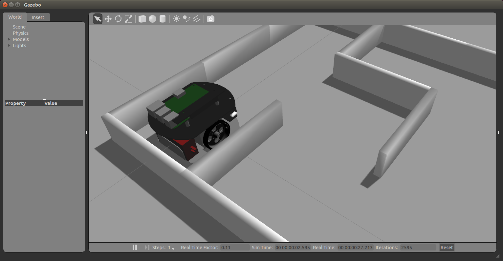
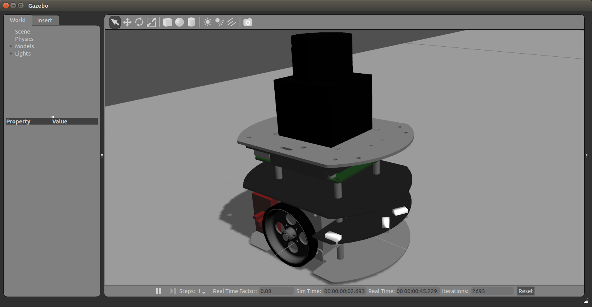

# raspimouse_sim 

[](https://travis-ci.org/rt-net/raspimouse_sim)

ROS package suite for Raspberry Pi Mouse Simulator runs on Gazebo

日本語版READMEは[こちら](./README.ja.md)です。

詳細なセットアップ方法は[Wiki](https://github.com/rt-net/raspimouse_sim/wiki)にまとめています。


## Requirements

requires the following to run:

* Ubuntu
  * Ubuntu Trusty 14.04
* ROS
  * ROS Indigo
* Gazebo
  * Gazebo 2.x
* ROS Package
  * ros-indigo-desktop-full
  * ros-indigo-gazebo-ros-control
  * ros-indigo-ros-controllers

## Installation

```
bash -exv -c "$(curl -sSfL https://git.io/raspimouse-sim-installer)"
```

## QuickStart

After the installation, run the followings:

```
rosrun raspimouse_control gen_dev_file.sh
roslaunch raspimouse_gazebo raspimouse_with_samplemaze.launch
```

Checkout [this page](https://github.com/rt-net/raspimouse_sim/wiki/quickstart) for details.

## Screenshots

### moving in sample maze



### moving with URG



## License

This repository is licensed under the MIT license, see [LICENSE]( ./LICENSE ).

Unless attributed otherwise, everything in this repository is under the MIT license.

### Includings & References

* [CIR-KIT/fourth_robot_pkg]( https://github.com/CIR-KIT/fourth_robot_pkg ) - BSD (BSD 3-Clause License)
  * urdf model xacro files
  * ros_control definition files
* [yujinrobot/kobuki]( https://github.com/yujinrobot/kobuki ) - BSD (BSD 3-Clause License)
  * launch files
